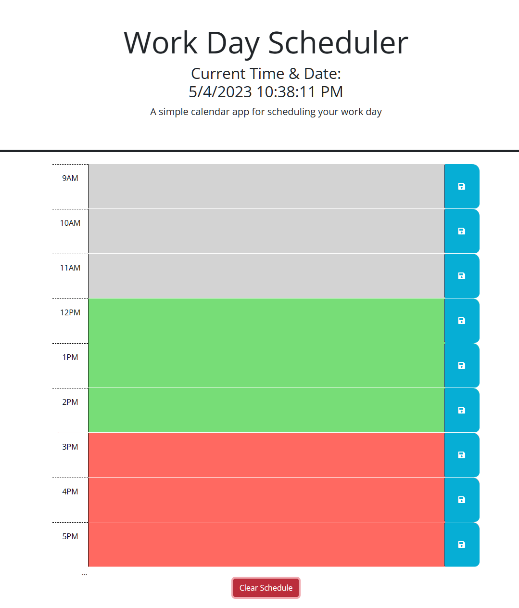

# Work Scheduler App

This is a time blocking app that helps you organize your schedule and tasks throughout the day. The app provides time blocks for each hour of the day, allowing you to schedule tasks and events in a clear and organized way.

## Features

- Color-coded time blocks indicate whether a block is in the past, present, or future
- User input is saved to local storage so that it persists even after the user closes the app
- Clear schedule button allows the user to clear all saved user input and start with a fresh schedule
- The current date and time are displayed at the top of the page

## Technologies Used

- HTML
- CSS
- JavaScript
- jQuery
- [dayjs](https://day.js.org/) library

## Getting Started
Follow this link to the deployed application: [Workday Scheduler App](https://kevhuff.github.io/scheduler-app)

To get started with this app, simply download or clone the repository and open the `index.html` file in your web browser.

## Usage

1. Enter your schedule and task details into the description field of each time block.
2. Click the save button to save your input to local storage, this will enable you to close the app and return to your schedule at a later time.
3. Color-coded time blocks will indicate whether a block is in the past, present, or future.
4. To clear all saved user input and start with a fresh schedule, click the clear schedule button. Please note there is no going back once shedule is cleared  **proceed with caution**

## Examples

## Contributors

- [Kevin Huffman](https://github.com/kevhuff)

## License

This project is licensed under the MIT License - see the [LICENSE](./LICENSE) file for details.

## Acknowledgments

- Thank you to the creators of the [dayjs](https://day.js.org/) library for making date and time manipulation in JavaScript a very simple task.